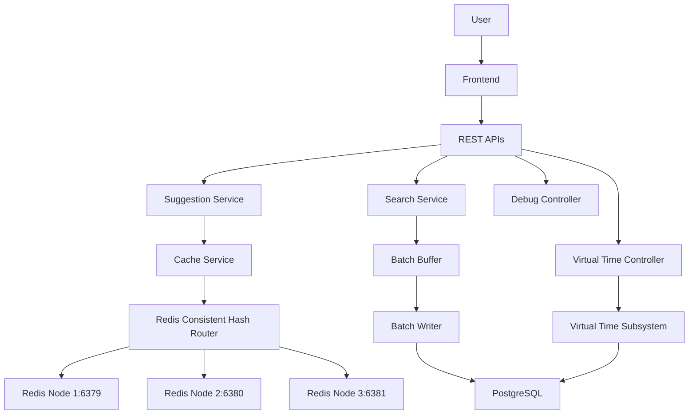

# Search Typeahead System

Search Typeahead System is a React + Vite + TypeScript frontend backed by a Spring Boot application with PostgreSQL, Redis, batch aggregation, and a virtual time subsystem.

## Features

- Single typeahead search box with live suggestions
- Integrated search submission
- Live virtual time panel
- Cache debug panel for Redis routing inspection
- PostgreSQL-backed search log and query aggregation
- Redis cache distributed across 3 standalone nodes
- Startup cache warmup for hot prefixes

## Architecture



## Technology Stack

Frontend:

- React
- Vite
- TypeScript

Backend:

- Spring Boot
- PostgreSQL
- Redis

## Setup

### Docker

From the repository root:

```bash
docker compose up
```

### Local Development

Backend:

```bash
cd backend
./mvnw spring-boot:run
```

On Windows:

```powershell
cd backend
.\mvnw.cmd spring-boot:run
```

Frontend:

```bash
cd frontend
npm install
npm run dev
```

## Dataset

The project uses the AOL Search Query Log dataset from 2006.

- `search_logs.csv` is the raw search-event dataset
- `queries_count.csv` is the aggregated query-statistics dataset generated from `search_logs.csv`

## APIs

Current backend endpoints:

- `POST /search`
- `GET /suggest?q=<prefix>&ranking=trending|global`
- `GET /trending`
- `GET /api/debug/cache`
- `GET /api/virtual-time`

The frontend uses `/suggest` only when the query has at least 3 characters.

## Cache Architecture

- 3 standalone Redis nodes
- Client-side consistent hashing in the backend
- Prefix cache keys in the form `prefix:<prefix>:<ranking>`
- Startup warmup for hot prefixes
- Cache invalidation on batch flush

## Virtual Time

The backend keeps a virtual time snapshot in PostgreSQL and a local JSON backup file. The active virtual time advances from the saved snapshot by real elapsed time, and batch flushes advance it by 60 seconds.

## Performance Summary

Latest verified metrics:

- Queries table: 1,244,165 rows
- Search logs table: 2,969,636 rows
- Warmup size: 50,000 queries
- Warmup prefixes generated: 14,405
- Cache entries generated by warmup: 28,810
- Current live Redis keys: 22,556 across 3 nodes

## Submission Documents

- [01_ARCHITECTURE.md](submission_report/01_ARCHITECTURE.md)
- [02_DATASET_AND_LOADING.md](submission_report/02_DATASET_AND_LOADING.md)
- [03_API_DOCUMENTATION.md](submission_report/03_API_DOCUMENTATION.md)
- [04_DESIGN_DECISIONS_AND_TRADEOFFS.md](submission_report/04_DESIGN_DECISIONS_AND_TRADEOFFS.md)
- [05_PERFORMANCE_REPORT.md](submission_report/05_PERFORMANCE_REPORT.md)
