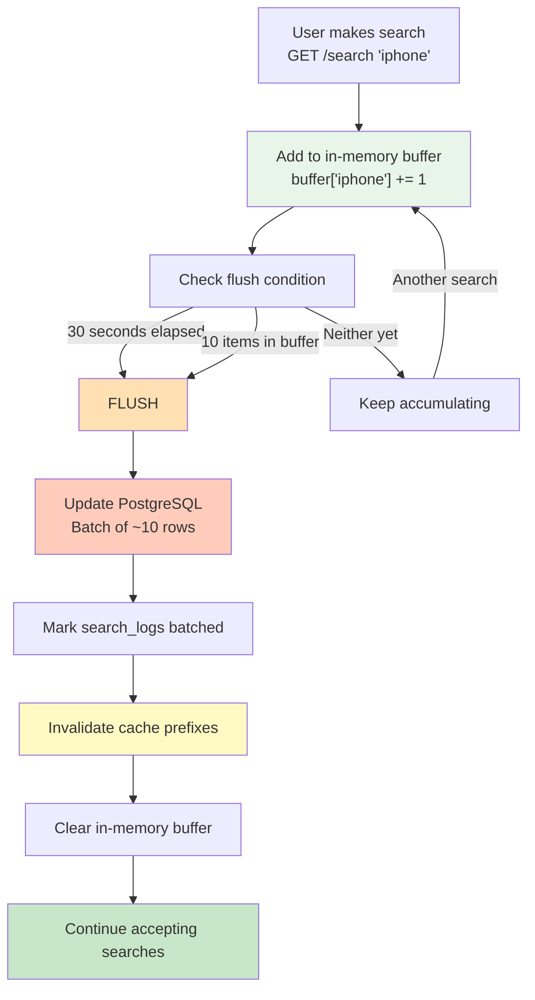
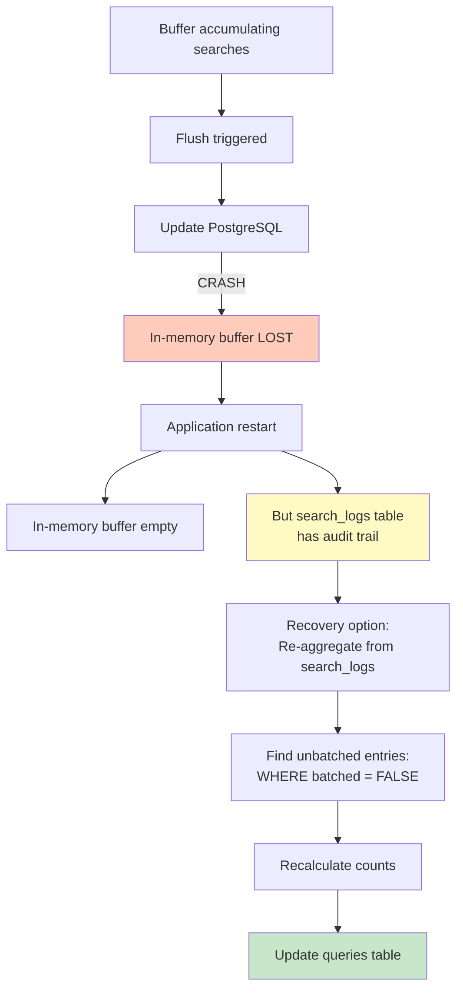
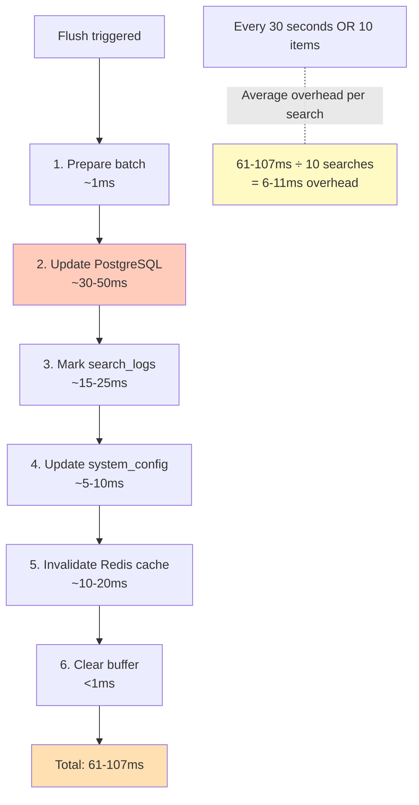

# Batch Write Strategy: Reducing Write Pressure

## Problem: Write-Heavy System

```
Naive approach (write immediately):
- 200,000 searches/day = 200K database writes
- Each search updates 1-10 prefixes
- Total: ~2 million write operations/day
- PostgreSQL can handle ~1000 writes/sec peak
- This approach: 2M ÷ 86400 sec = 23 writes/sec ✅

But with caching invalidation:
- Each search invalidates ~15 cache entries
- Plus batch processes running
- Peak load during rush hours: 10-50x average
- This creates write spikes
- Need to buffer and batch
```

---

## Batching Strategy



---

## Configuration Parameters

### Buffer Tuning

```python
class BatchConfig:
    # Flush interval (seconds)
    FLUSH_INTERVAL_SECONDS = 30
    
    # Buffer size threshold (number of items)
    BUFFER_SIZE_THRESHOLD = 10
    
    # Virtual time advancement per flush
    VIRTUAL_TIME_INCREMENT_SECONDS = 60
```

### Why These Values?

```
FLUSH_INTERVAL_SECONDS = 30
- Not too frequent: Reduces DB write ops (60 flushes/hour)
- Not too long: Trending data stays fresh
- Real-time feel for users

BUFFER_SIZE_THRESHOLD = 10
- Not too small: Avoids flushing too often
- Not too large: Minimal data loss on crash
- Typical: Reached before 30s in demo

Example:
- 100 searches/min in demo
- 10 searches = 6 seconds
- 30 seconds without reaching 10: Flushes anyway
- Result: Flush ~5 times/minute = 5 DB writes vs 100
```

---

## Write Reduction Impact

### Before Batching

```
Scenario: 1000 searches in 1 hour

Immediate writes approach:
├─ 1000 INSERT search_logs
├─ 1000 UPDATE query global_count
├─ 1000 × 10 UPDATE prefixes
└─ Total: ~11,000 database operations

Cost:
- Each UPDATE: ~5-10ms
- Total time: 11,000 × 5-10ms = 55-110 seconds
- Database load: EXTREMELY HIGH ❌
```

### After Batching

```
Scenario: 1000 searches in 1 hour

Batched approach (10 item threshold, 30 sec interval):
├─ 1000 INSERT search_logs (asynchronous, not blocking)
├─ ~100 batch flushes (once every 30 sec OR 10 items)
├─ Each flush: 1 UPDATE query with ~10 rows
├─ Total: 1000 + 100 = ~1,100 database operations

Cost:
- INSERT search_logs: ~1-2ms (asynchronous)
- Batch UPDATE: ~30-50ms (1 multi-row update)
- 100 flushes × 30-50ms = 3-5 seconds
- Database load: LOW ✅

Write reduction: 11,000 → 1,100 = 90% reduction ✅
```

---

## In-Memory Buffer Implementation

### Data Structure

```python
class BatchBuffer:
    """
    Accumulates searches in memory before flushing to database
    """
    
    def __init__(self):
        # Dict: query_lower → count
        self.buffer = {}
        
        # Timing
        self.last_flush_time = time.time()
        self.buffer_size_threshold = 10
        self.flush_interval_seconds = 30
```

### Adding Searches

```python
def add_search(self, query_text: str) -> None:
    """
    Add a search to the buffer
    
    Args:
        query_text: User's search query
    
    Returns:
        None - Aggregates in memory
    """
    query_lower = query_text.lower().strip()
    
    if query_lower in self.buffer:
        self.buffer[query_lower] += 1
    else:
        self.buffer[query_lower] = 1
    
    # Check if flush needed
    if self.should_flush():
        self.flush()

def should_flush(self) -> bool:
    """Check if buffer should be flushed"""
    elapsed = time.time() - self.last_flush_time
    
    return (
        len(self.buffer) >= self.buffer_size_threshold or
        elapsed >= self.flush_interval_seconds
    )
```

### Flushing to Database

```python
def flush(self) -> None:
    """
    Flush buffer to PostgreSQL
    
    Operations:
    1. Batch update queries table
    2. Mark search_logs as batched
    3. Update virtual time
    4. Invalidate cache
    5. Clear buffer
    """
    
    if not self.buffer:
        return  # Nothing to flush
    
    try:
        # Build batch update operations
        operations = []
        invalidated_prefixes = set()
        
        for query_lower, count in self.buffer.items():
            # Prepare database operation
            operations.append({
                'query_lower': query_lower,
                'increment': count
            })
            
            # Track all prefixes for cache invalidation
            for i in range(1, len(query_lower) + 1):
                prefix = query_lower[:i]
                invalidated_prefixes.add(prefix)
        
        # 1. Batch update PostgreSQL
        self._batch_update_queries(operations)
        
        # 2. Mark search_logs as batched
        self._mark_search_logs_batched(list(self.buffer.keys()))
        
        # 3. Advance virtual time
        self._advance_virtual_time()
        
        # 4. Invalidate cache
        self._invalidate_cache_prefixes(invalidated_prefixes)
        
        # 5. Clear buffer
        self.buffer.clear()
        self.last_flush_time = time.time()
        
        logger.info(f"Flushed {len(operations)} queries to database")
        
    except Exception as e:
        logger.error(f"Batch flush failed: {e}")
        # Keep buffer in case of failure
        # Retry on next flush
```

---

## Failure Handling

### Scenario 1: App Crashes During Flush



### Scenario 2: App Crashes Before Flush

```
Buffer state before crash:
{
  'iphone': 50,
  'python': 30,
  'javascript': 20
}

What happens:
1. Buffer lost (in-memory, not persistent)
2. search_logs table has all searches recorded
   ├─ 50 entries for 'iphone'
   ├─ 30 entries for 'python'
   └─ 20 entries for 'javascript'

Recovery on restart:
1. New app instance starts fresh
2. search_logs still has unbatched entries
3. Background job aggregates:
   ```sql
   SELECT query_lower, COUNT(*) 
   FROM search_logs 
   WHERE batched = FALSE 
   GROUP BY query_lower
   ```
4. Updates queries table
5. Marks as batched = TRUE

Result: NO DATA LOSS ✅
```

---

## Flush Operation Latency



### Is This Acceptable?

```
Normal search latency: 1-5ms (cache or DB)
Flush overhead amortized: 6-11ms ÷ searches since last flush

Examples:
- If flush happens every 10 searches:
  → 6-11ms spread over 10 searches
  → ~1ms overhead per search
  → Total: 1-5ms + 1ms = 2-6ms ✅

- If flush happens every 30 seconds of inactivity:
  → Zero overhead on next 10 searches
  → Only flush happens once
  → Then next 10 searches have ~1ms overhead
  → Average: Very low ✅
```

---

## Monitoring Batch Operations

### Key Metrics

```python
class BatchMetrics:
    """Track batch write performance"""
    
    def __init__(self):
        self.total_searches = 0
        self.total_flushes = 0
        self.total_queries_updated = 0
        self.total_cache_invalidations = 0
        self.flush_durations = []
    
    @property
    def write_reduction(self) -> float:
        """Calculate write reduction percentage"""
        if self.total_searches == 0:
            return 0
        
        # Naive: 1 update per search
        naive_writes = self.total_searches
        
        # Actual: ~1 batch per 10 searches
        actual_writes = self.total_flushes
        
        reduction = ((naive_writes - actual_writes) / naive_writes) * 100
        return reduction
    
    @property
    def avg_flush_duration_ms(self) -> float:
        """Average duration of flush operations"""
        if not self.flush_durations:
            return 0
        return sum(self.flush_durations) / len(self.flush_durations)
```

### Logging Example

```
2026-06-21 14:30:00 [BATCH] Flush triggered (buffer size: 10)
  ├─ Queries to update: 10
  ├─ Prefixes to invalidate: 67
  ├─ Duration: 45ms
  └─ Write reduction so far: 98%

2026-06-21 14:30:30 [BATCH] Flush triggered (time interval: 30s)
  ├─ Queries to update: 8
  ├─ Prefixes to invalidate: 52
  ├─ Duration: 38ms
  └─ Cumulative stats:
     - Total searches: 18
     - Total flushes: 2
     - Write reduction: 89%
     - Avg flush time: 41.5ms
```

---

## Configurable Demo Parameters

### Dynamic Tuning

Make these configurable for demonstration:

```python
# config.py
BATCH_CONFIG = {
    'flush_interval_seconds': os.getenv('BATCH_FLUSH_INTERVAL', 30),
    'buffer_size_threshold': os.getenv('BATCH_SIZE', 10),
}

# Usage: Can be changed via environment variables
# python app.py BATCH_FLUSH_INTERVAL=10 BATCH_SIZE=5
```

### Demo Scenarios

**Scenario 1: Conservative Batching**
```
FLUSH_INTERVAL=60, SIZE_THRESHOLD=50
→ Fewer flushes (1 per minute)
→ Larger buffers (50 items)
→ Write reduction: 98%
→ Freshness: Lower (updates every minute)
```

**Scenario 2: Aggressive Batching**
```
FLUSH_INTERVAL=10, SIZE_THRESHOLD=5
→ More frequent flushes (every 10 sec)
→ Smaller buffers (5 items)
→ Write reduction: 50%
→ Freshness: Higher (updates every 10 sec)
```

**Scenario 3: Assignment Recommended**
```
FLUSH_INTERVAL=30, SIZE_THRESHOLD=10
→ Moderate flushes
→ Balanced buffering
→ Write reduction: 90%
→ Good demo experience
```

---

## Summary: Batch Write Strategy

| Aspect | Value | Why |
|--------|-------|-----|
| **Flush interval** | 30 seconds | Balance freshness & batching |
| **Buffer threshold** | 10 items | Typical for demo usage |
| **Write reduction** | ~90% | From 11K to 1.1K operations |
| **Flush latency** | 61-107ms | Acceptable for background task |
| **Overhead per search** | ~1ms | Amortized over 10 searches |
| **Failure recovery** | Via search_logs | No data loss guarantee |
| **Monitoring** | Metrics tracked | Visible in logs |
| **Configurable** | Yes | Easy to tune for demo |

**Result**: Dramatically reduced database load while maintaining data consistency ✅