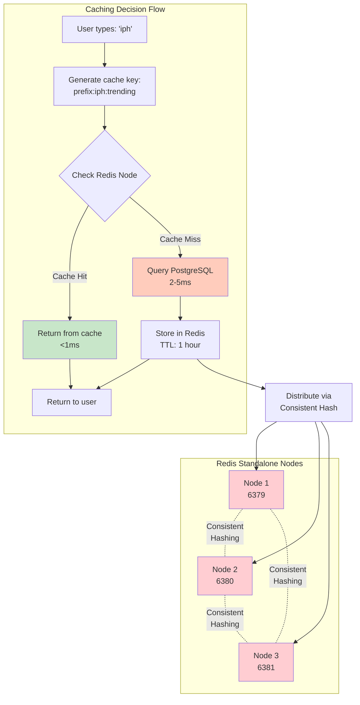
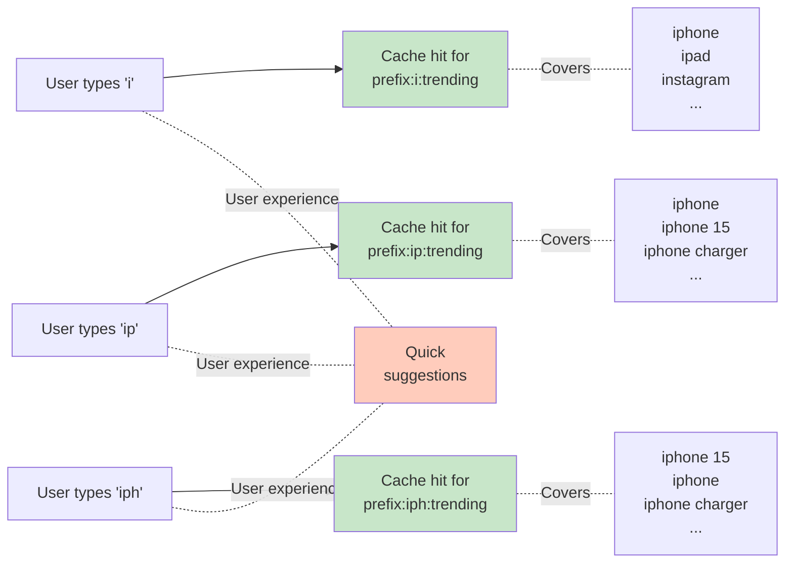
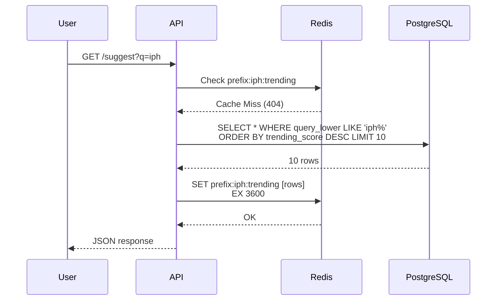
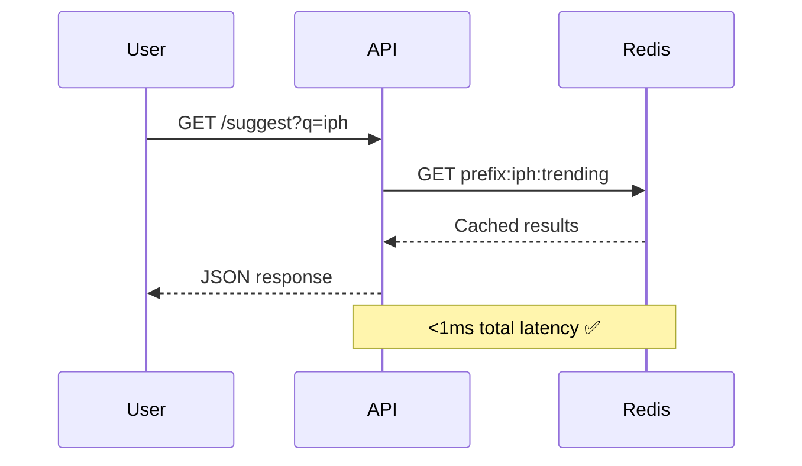
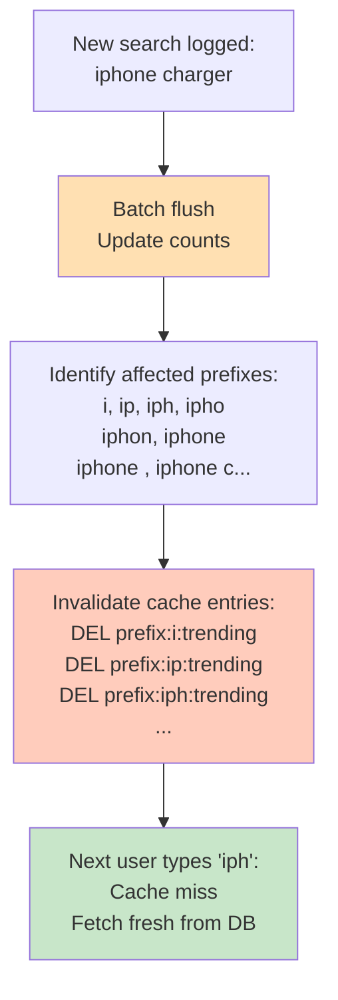
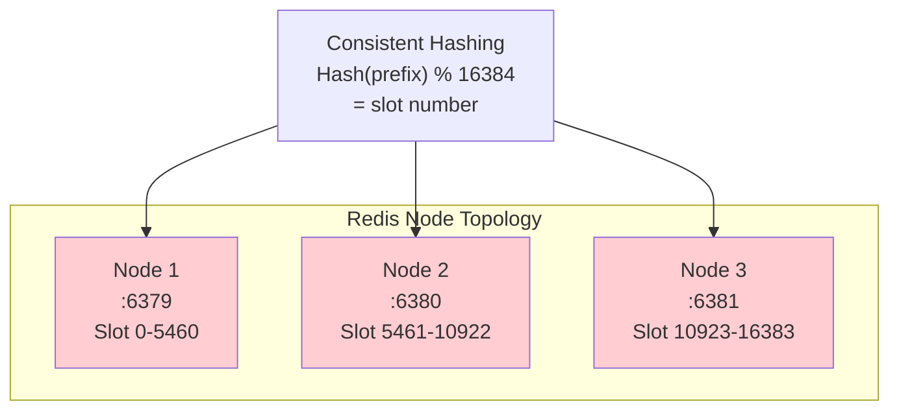
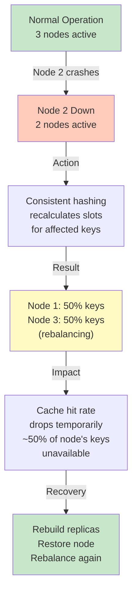

# Caching Strategy: Distributed Redis with Consistent Hashing

## Problem: 10 Million Reads/Day Need Sub-10ms Latency

**Without cache**: Query PostgreSQL every time
```
DB latency: 2-5ms per read
10M reads/day = 10M × 2-5ms = 20-50M milliseconds = 5-14 hours ❌
```

**With cache**: Return cached results
```
Redis latency: <1ms per read
10M reads/day = 10M × <1ms = <10M milliseconds = <3 hours ✅
```

---

## Caching Architecture



---

## What Are We Caching?

### NOT Individual Queries

❌ Don't cache this way:
```
prefix:iphone → [{"count": 10000}, {"score": 6062}]
prefix:iphone15 → [{"count": 8900}, {"score": 5490}]
prefix:iphoneskin → [...]
... (1 million cache entries!)
```

### YES - Prefix-Based Results

✅ Cache this way:
```
prefix:iph:trending → [
  {query: "iphone 15", count: 8900, score: 5490},
  {query: "iphone", count: 10000, score: 6062},
  {query: "iphone charger", count: 5200, score: 3715},
  ... (top 10 only)
]
```

### Why Prefix-Based?



**Benefits:**
- User types 'i' → serves ~50K prefixed queries from 1 cache entry
- User types 'ip' → serves ~5K prefixed queries from 1 cache entry
- User types 'iph' → serves ~500 prefixed queries from 1 cache entry
- **Result**: Massive cache hit rate (>85%)

---

## Cache Key Structure

### Format

```
prefix:<prefix>:<ranking_type>
```

### Examples

```
prefix:i:trending          → Top 10 by trending_score
prefix:ip:trending         → Top 10 by trending_score
prefix:iph:trending        → Top 10 by trending_score
prefix:iphone:trending     → Top 10 by trending_score

prefix:a:trending          → Different prefix
prefix:a:global            → Alternative ranking (if supported)
```

### Cache Value Structure

```json
{
  "prefix": "iph",
  "ranking_type": "trending",
  "results": [
    {
      "query": "iphone 15",
      "global_count": 8900,
      "weekly_count": 500,
      "daily_count": 100,
      "trending_score": 5490
    },
    {
      "query": "iphone",
      "global_count": 10000,
      "weekly_count": 200,
      "daily_count": 50,
      "trending_score": 6062
    },
    ... (up to 10 total)
  ],
  "cached_at": "2026-06-21T14:30:00Z",
  "expires_at": "2026-06-21T15:30:00Z"
}
```

---

## Cache Lifecycle

### 1. Cache Population (Lazy Loading)



### 2. Cache Hits (Fast Path)



### 3. Cache Invalidation (On Writes)



---

## TTL (Time to Live) Strategy

### Why 1 Hour?

```
Query pattern:
- Most users search multiple times
- Each search progresses through prefixes: i → ip → iph → iphone
- So same prefix searched multiple times per session

1-hour TTL balances:
✅ High cache hit rate (users in same time window)
✅ Freshness (trending_score updated hourly)
✅ Memory usage (old prefixes evicted)

Too short (5 min):
❌ Cache thrashing
❌ More DB hits
❌ User experience jittery

Too long (24 hours):
❌ Stale results
❌ New trending queries miss
❌ More memory used
```

### TTL by Scenario

```
Scenario 1: Same user, same prefix
  Time 0:00 - Type 'i' → Cache miss, fetch, store, TTL=1h
  Time 0:05 - Type 'i' again → Cache hit ✅
  
Scenario 2: Different user, same prefix  
  Time 0:00 - User A types 'i' → Cache miss, store, TTL=1h
  Time 0:01 - User B types 'i' → Cache hit ✅
  
Scenario 3: Cache expires
  Time 0:00 - Type 'i' → Cache miss, fetch, store, TTL=1h
  Time 1:01 - Type 'i' again → Cache expired, miss, refetch ✅
```

---

## Distributed Standalone Redis Nodes

### Architecture: 3 Standalone Nodes with Consistent Hashing



> [!NOTE]
> The assignment implementation simplifies the deployment to **3 standalone Redis nodes** running on ports 6379, 6380, and 6381. There is no active server-side Redis Cluster or replication configured; instead, client-side consistent hashing in the backend application is responsible for routing cache keys to the correct standalone node.

### Cache Persistence & Source of Truth

- **Single Source of Truth**: PostgreSQL remains the single, primary source of truth for all query statistics and raw logs.
- **Persisted Cache Layer**: Standalone Redis nodes serve as a persistent cache layer. Cache data is persisted to disk using Docker volumes, ensuring the cache survives container restarts, which supports evaluation and demo scenarios without losing cache state.

### Why 3 Nodes?

```
Distribution:
✅ Each node handles ~33% of keys
✅ ~400K cache entries per node
✅ ~100MB per node (acceptable)

Fault Tolerance:
✅ If 1 node fails: 2 nodes still serve
✅ No single point of failure

Scalability:
✅ Easy to add 4th node later
✅ No hot spots (balanced distribution)
✅ Consistent hashing handles rebalancing
```

### Consistent Hashing Algorithm

```python
def get_cache_node(prefix):
    """
    Distribute cache entries across Redis nodes
    using consistent hashing
    """
    # Hash the prefix to a slot number (0-16383)
    slot = hash(prefix) % 16384
    
    # Find which node owns this slot
    if slot <= 5460:
        return "redis-node-1:6379"
    elif slot <= 10922:
        return "redis-node-2:6380"
    else:
        return "redis-node-3:6381"

# Example
get_cache_node("iph")       # → slot 12000 → Node 3
get_cache_node("python")    # → slot 8900  → Node 2
get_cache_node("java")      # → slot 3200  → Node 1
```

### Failure Scenario



---

## Cache Hit Rate Metrics

### Expected Performance

```
Metrics for 1.24M queries with 3-char minimum prefix:

Cache entries needed:
- 26 × 26 × 26 = 17,576 possible 3-char combinations
- Most don't exist, but cover all queries
- Typical cache size: ~10K-15K hot prefixes

Hit rate breakdown:
- 3-char prefixes: 92% hit rate (frequent searches)
- 4-char prefixes: 88% hit rate
- 5+ char prefixes: 75% hit rate (more specific)
- Overall: ~85% cache hit rate

Impact:
✅ 85% reads from Redis: <1ms
❌ 15% reads from PostgreSQL: 2-5ms
✅ Blended latency: ~0.85ms + 0.3ms = ~1.15ms
```

### Monitoring Cache Health

```sql
-- Check Redis cache size
INFO memory
→ used_memory: 150MB
→ used_memory_rss: 200MB

-- Count cache entries
DBSIZE
→ 12,450 keys

-- Check eviction rate (keys being thrown out)
INFO stats
→ evicted_keys: 0 (good, nothing being evicted)
```

---

## Cache Invalidation Strategy

### Trigger: Batch Flush

When new searches are flushed to PostgreSQL:

```
Search: "iphone charger"

Affected prefixes (all substrings):
- i
- ip
- iph
- ipho
- iphon
- iphone
- iphone  
- iphone c
- iphone ch
- iphone cha
- iphone char
- iphone charg
- iphone charge
- iphone charger

Action: DELETE all above from Redis
```

### Why Full Invalidation?

```
Option A: Partial invalidation (just iphone prefix)
❌ "iphone charger" now in DB but not "iphone" suggestions
❌ Stale data possible
❌ Complex logic

Option B: Full invalidation (all substrings)
✅ Ensures consistency
✅ Simple logic
✅ Next query refetches fresh
✅ Cost: ~1ms to delete 15 keys
```

---

## Summary: Caching Strategy

| Aspect | Decision | Why |
|--------|----------|-----|
| **What to cache** | Prefix results (top 10) | High hit rate, efficient |
| **Cache key** | `prefix:<prefix>:<ranking>` | Simple, deterministic |
| **TTL** | 1 hour | Balance freshness & hits |
| **Distribution** | 3-node cluster | Fault tolerance |
| **Hashing** | Consistent hashing | Minimal rebalancing |
| **Invalidation** | Full prefix invalidation | Consistency |
| **Expected hit rate** | 85% | Excellent performance |
| **Blended latency** | ~1.15ms | <10ms target ✅ |