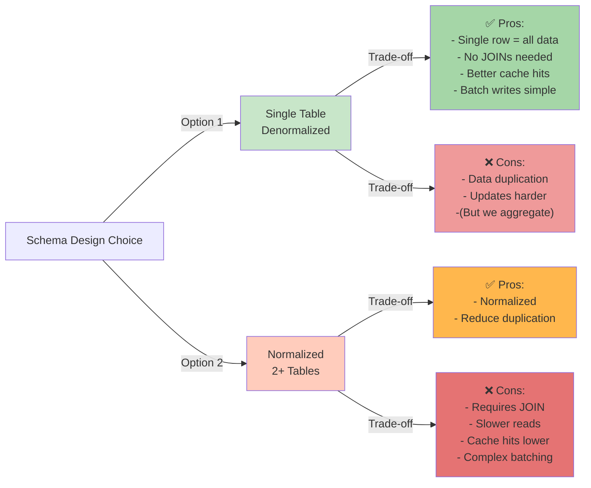

# Database Design Decision

## Choice: Single Table Denormalization + Raw Search Logs

### Executive Summary

**Selected Approach**: 
- Single denormalized `queries` table for pre-computed suggestions
- Raw `search_logs` table for audit trail and new searches
- In-memory `batch_buffer` for batching

---

## Why This Design?

### Problem: What data structure for 1.24M queries?



### Trade-off Analysis Table

| Aspect | Single Table | Normalized | Decision |
|--------|-------------|-----------|----------|
| **Read Speed** | Direct single row access | Requires JOIN | ✅ Single (Better) |
| **Write Pattern** | Batch UPDATE all columns | Separate INSERT/UPDATE | ✅ Single (Matches batch strategy) |
| **Cache Friendliness** | Entire row cacheable | Split across tables | ✅ Single (Higher hit rate) |
| **Data Integrity** | None needed (immutable text) | FOREIGN KEY enforced | ✅ Single (Immutable data) |
| **Storage** | Slight duplication | Optimized | Negligible (1.24M rows) |
| **Query Complexity** | Simple | Medium | ✅ Single (Simpler) |

### Justification

1. **Query text is immutable** - Never UPDATE query_text after insert, so no need for normalization benefits

2. **Read pattern: Always read all columns together**
   ```sql
   SELECT query_text, global_count, weekly_count, daily_count, trending_score
   FROM queries 
   WHERE query_lower LIKE 'iph%'
   ORDER BY trending_score DESC
   LIMIT 10;
   ```
   - Single table = 1 scan
   - Normalized = 1 scan + JOINs

3. **Write pattern: Batch aggregation**
   - 1000s of searches aggregated in memory
   - Single batch UPDATE per flush
   - No need for normalized insert patterns

4. **Cache optimization**
   - Cache key: `prefix:iph:trending`
   - Value: JSON of 10 complete rows
   - Single table = row is "complete"
   - Normalized = need multiple tables in cache

---

## Final Database Schema

### Table 1: Pre-computed Suggestions (Aggregated from Dataset)

```sql
CREATE TABLE queries (
  id BIGSERIAL PRIMARY KEY,
  query_text VARCHAR(255) NOT NULL UNIQUE,
  query_lower VARCHAR(255) NOT NULL,
  
  -- Counts from original dataset (2006)
  global_count INTEGER DEFAULT 0,
  weekly_count INTEGER DEFAULT 0,
  daily_count INTEGER DEFAULT 0,
  trending_score DECIMAL(10,2) DEFAULT 0,
  
  -- Lifecycle tracking (in 2006 context)
  first_searched_at TIMESTAMP,
  last_searched_at TIMESTAMP,
  
  -- Score calculation timing
  trending_score_calculated_at TIMESTAMP,
  
  -- Real-world audit
  created_at TIMESTAMP DEFAULT CURRENT_TIMESTAMP,
  updated_at TIMESTAMP DEFAULT CURRENT_TIMESTAMP
);
```

**Purpose**: Store pre-computed suggestions from 1.24M aggregated queries. Read-only for suggestions API.

### Table 2: Raw Search Logs (Audit Trail)

```sql
CREATE TABLE search_logs (
  id BIGSERIAL PRIMARY KEY,
  query_lower VARCHAR(255) NOT NULL,
  query_text VARCHAR(255),
  
  -- Virtual time when search happened (2006 context)
  virtual_searched_at TIMESTAMP NOT NULL,
  
  -- Real-world time (audit trail)
  created_at TIMESTAMP DEFAULT CURRENT_TIMESTAMP,
  
  -- Batching status
  batched BOOLEAN DEFAULT FALSE,
  batched_at TIMESTAMP
);
```

**Purpose**: Complete audit trail of every search. Source for batching and re-aggregation.

### Table 3: System Configuration (Virtual Time)

```sql
CREATE TABLE system_config (
  id SERIAL PRIMARY KEY,
  config_key VARCHAR(100) UNIQUE NOT NULL,
  config_value TEXT NOT NULL,
  updated_at TIMESTAMP DEFAULT CURRENT_TIMESTAMP
);
```

**Purpose**: Store virtual time checkpoint for app restart/resume.

---

## Data Flow Diagram

```mermaid
graph TD
    A["📥 Dataset<br/>3.6M raw logs<br/>2006-03-01 to 2006-05-31"]
    
    B["🔧 Aggregation<br/>Count occurrences<br/>Calculate trending_score<br/>Group by query"]
    
    C["💾 Load to PostgreSQL<br/>queries table<br/>1.24M unique queries"]
    
    D["👤 User Types<br/>Real-world 2026-06-21<br/>In app context"]
    
    E["🔍 Search Query<br/>GET /suggest?q=iph"]
    
    F{{"🔴 Check Redis<br/>Cache?"}}
    
    G["✅ Cache Hit<br/>Return from Redis<br/>~1-5ms"]
    
    H["❌ Cache Miss<br/>Query PostgreSQL<br/>queries table"]
    
    I["📝 Log Search<br/>Insert to search_logs<br/>virtual_searched_at"]
    
    J["📦 Add to Batch Buffer<br/>In-memory aggregation"]
    
    K{{"Flush Condition?<br/>30s OR 10 items"}}
    
    L["⚙️ Batch Flush<br/>UPDATE queries table<br/>Invalidate Redis"]
    
    M["💾 Aggregate Back<br/>Update counts<br/>Recalculate trending_score"]
    
    N["📤 Return Suggestions<br/>Top 10 by trending_score"]
    
    A --> B
    B --> C
    
    D --> E
    E --> F
    F -->|Hit| G
    F -->|Miss| H
    H --> M
    M --> N
    G --> N
    
    E --> I
    I --> J
    J --> K
    K -->|Yes| L
    K -->|No| J
    L --> M
    
    style A fill:#e3f2fd
    style C fill:#f3e5f5
    style E fill:#fff3e0
    style F fill:#ffebee
    style G fill:#c8e6c9
    style H fill:#ffccbc
    style L fill:#ffe0b2
    style N fill:#b2dfdb
