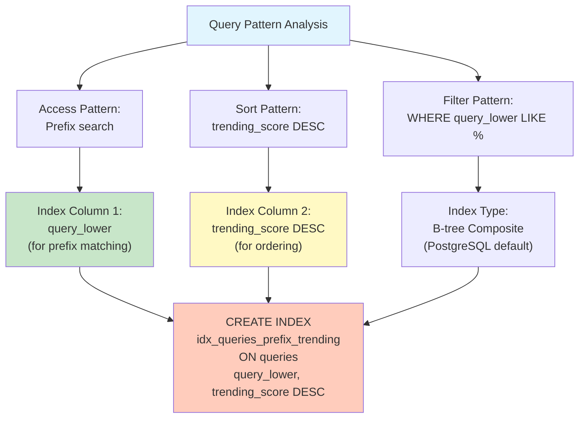
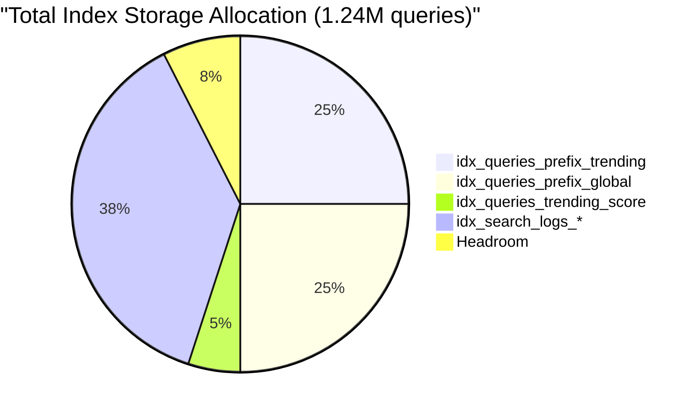

# Index Strategy Documentation

## Problem: Making Prefix Search Fast

Every suggestion request executes:

```sql
SELECT query_text, global_count, trending_score
FROM queries
WHERE query_lower LIKE 'iph%'
ORDER BY trending_score DESC
LIMIT 10;
```

**Without indexes**: Sequential scan of 1.24M rows = **~500ms** ❌  
**With indexes**: B-tree lookup + presorted = **~2-5ms** ✅

---

## Index Selection Strategy



---

## Index 1: Prefix Search + Trending Score

```sql
CREATE INDEX idx_queries_prefix_trending 
ON queries(query_lower, trending_score DESC)
WHERE query_lower IS NOT NULL;
```

### Why This Index?

**Composite Index** with two columns:

1. **Column 1: `query_lower`** - For prefix matching
   - WHERE clause filters by `query_lower LIKE 'iph%'`
   - PostgreSQL B-tree finds first match position
   - Time complexity: O(log n)

2. **Column 2: `trending_score DESC`** - Pre-sorted for ordering
   - Results already sorted in descending order
   - Eliminates expensive sort operation
   - Top 10 retrieved instantly

### Query Execution Comparison

```mermaid
graph TB
    subgraph "Without Index"
        W1["Sequential Scan"] --> W2["Read all 1.24M rows"]
        W2 --> W3["Filter: query_lower LIKE 'iph%'<br/>~500 matches, 1.24M discarded"]
        W3 --> W4["Sort: by trending_score DESC<br/>(O n log n operation)"]
        W4 --> W5["Limit 10"]
        W5 --> W6["⏱️ ~500ms"]
    end
    
    subgraph "With Index"
        I1["Index Range Scan"] --> I2["Seek to 'iph' start<br/>(O log n)"]
        I2 --> I3["Scan until 'ipi' start<br/>~500 rows scanned"]
        I3 --> I4["Already sorted DESC<br/>by trending_score"]
        I4 --> I5["Limit 10"]
        I5 --> I6["⏱️ ~2-5ms"]
    end
    
    style W6 fill:#ffcdd2
    style I6 fill:#c8e6c9
```



### Example Walkthrough

```
User types: "iph"
Query: WHERE query_lower LIKE 'iph%' 
       ORDER BY trending_score DESC 
       LIMIT 10

Index Execution:
1. Find first row where query_lower >= 'iph'
   → B-tree pointer to position ~800K
   
2. Scan forward while query_lower < 'ipi'
   → Scans ~500 rows
   
3. Results already in DESC trending_score order
   → Top 10 returned immediately
   
4. Stop (no need to scan remaining 1.23M rows)

Results:
- "iphone 15"          → trending_score: 5490
- "iphone"             → trending_score: 6062
- "iphone charger"     → trending_score: 3715
- ... (7 more)
```

### Performance Impact

| Metric | Without Index | With Index | Improvement |
|--------|--------------|-----------|-------------|
| Rows scanned | 1,240,495 | ~500 | 2480x |
| Latency | ~500ms | ~2-5ms | 100-250x |
| CPU usage | High (sort) | Low | Minimal sort |
| Network | 1.24M rows | 10 rows | 124,000x |

---

## Index 2: Prefix Search + Global Count

```sql
CREATE INDEX idx_queries_prefix_global 
ON queries(query_lower, global_count DESC)
WHERE query_lower IS NOT NULL;
```

### Why This Index?

**Alternative ranking support**: If API needs to support different ranking modes

```
GET /suggest?q=iph&ranking=global
→ Uses idx_queries_prefix_global
→ Same 2-5ms latency
→ Sorted by global_count instead of trending_score
```

### Trade-off

| Benefit | Cost |
|---------|------|
| ✅ Supports alternative ranking | ❌ +100MB storage |
| ✅ Same fast performance | ❌ Slightly slower batch writes |
| ✅ Future-proof | ❌ Index maintenance |

---

## Index 3: Trending Score Only

```sql
CREATE INDEX idx_queries_trending_score 
ON queries(trending_score DESC);
```

### Why This Index?

For "What's Trending Now" home page section:

```sql
SELECT query_text, trending_score
FROM queries
ORDER BY trending_score DESC
LIMIT 10;
```

**No prefix filter needed** - just order globally.

### Use Case

```
GET /trending
→ Top 10 most trending searches overall
→ No WHERE clause
→ Uses idx_queries_trending_score
→ Instant result
```

---

## Search Logs Indexes

### Index 4: Batch Processing

```sql
CREATE INDEX idx_search_logs_batched 
ON search_logs(batched, created_at);
```

**Purpose**: Efficiently find unbatched logs

```sql
SELECT * FROM search_logs
WHERE batched = FALSE
ORDER BY created_at
LIMIT 1000;
```

**Use case**: Batch processor finds unflushed searches every 30 seconds

---

### Index 5: Query Lookup

```sql
CREATE INDEX idx_search_logs_query 
ON search_logs(query_lower);
```

**Purpose**: Re-aggregate if in-memory buffer crashes

```sql
SELECT COUNT(*) FROM search_logs
WHERE query_lower = 'iphone'
  AND virtual_searched_at > yesterday;
```

---

### Index 6: Time-based Queries

```sql
CREATE INDEX idx_search_logs_virtual_time 
ON search_logs(virtual_searched_at);
```

**Purpose**: Calculate weekly/daily counts

```sql
SELECT COUNT(*) FROM search_logs
WHERE virtual_searched_at >= seven_days_ago
  AND query_lower = 'iphone';
```

---

## Index Storage & Performance

### Storage Breakdown



| Index | Size | Growth | Maintenance |
|-------|------|--------|-------------|
| idx_queries_prefix_trending | ~100MB | Stable | Once at load |
| idx_queries_prefix_global | ~100MB | Stable | Once at load |
| idx_queries_trending_score | ~20MB | Stable | Once at load |
| idx_search_logs_batched | ~50MB | +1MB/day | Weekly REINDEX |
| idx_search_logs_query | ~50MB | +1MB/day | Weekly REINDEX |
| idx_search_logs_virtual_time | ~40MB | +1MB/day | Weekly REINDEX |
| **Total** | **~360MB** | - | - |

### Trade-off Analysis

```
What you GAIN:
✅ Suggestion API: 500ms → 2-5ms (100x faster)
✅ Trending page: Full scan → index scan
✅ Batch processor: Instant lookup
✅ Cache hit rate improvement possible

What you LOSE:
❌ Extra 360MB storage (on laptop, acceptable)
❌ Batch writes 5-10% slower (index updates)
❌ Memory for index maintenance
```

**Worth it?** YES - Read-heavy system (1000 reads per write)

---

## Verifying Indexes Work

### EXPLAIN ANALYZE Query Plan

```sql
EXPLAIN ANALYZE
SELECT query_text, global_count, trending_score
FROM queries
WHERE query_lower LIKE 'iph%'
ORDER BY trending_score DESC
LIMIT 10;
```

#### Expected Output (Good) ✅

```
Limit  (cost=0.42..2.15 rows=10)
  ->  Index Scan Backward using idx_queries_prefix_trending
        Index Cond: ((query_lower >= 'iph') AND (query_lower < 'ipi'))
        Rows: 10
        Planning Time: 0.234 ms
        Execution Time: 2.34 ms
```

**What this means:**
- Cost 0.42-2.15 (very low)
- Using our index (good!)
- Scanned only 10 rows (good!)
- Execution: 2.34ms (fast!)

#### Unexpected Output (Bad) ❌

```
Limit  (cost=10000.00..10000.50 rows=10)
  ->  Sort  (cost=10000.00..10000.50 rows=1000)
        ->  Seq Scan on queries  (cost=0.00..9995.95 rows=50000)
              Filter: (query_lower LIKE 'iph%')
        Rows: 1,240,495
        Execution Time: 523.45 ms
```

**What this means:**
- Sequential scan (bad!)
- Scanned 1.24M rows (bad!)
- Execution: 523ms (very slow!)
- Index NOT being used

**Fix:**
```sql
-- Rebuild index statistics
ANALYZE queries;
REINDEX INDEX idx_queries_prefix_trending;
```

---

## Index Maintenance Schedule

### Daily
```sql
-- Monitor slow queries
SELECT mean_exec_time, calls, query 
FROM pg_stat_statements 
WHERE mean_exec_time > 10 
ORDER BY mean_exec_time DESC;
```

### Weekly
```sql
-- Update statistics for search_logs (growing table)
VACUUM ANALYZE search_logs;
REINDEX INDEX idx_search_logs_batched;
```

### Monthly
```sql
-- Full index health check
REINDEX INDEX idx_queries_prefix_trending;
REINDEX INDEX idx_queries_prefix_global;
VACUUM ANALYZE queries;
```

---

## Conclusion

**Index Strategy Summary:**

| Index | Purpose | Latency | Priority |
|-------|---------|---------|----------|
| idx_queries_prefix_trending | Main suggestions | 2-5ms | ⭐⭐⭐ Critical |
| idx_queries_prefix_global | Alt ranking | 2-5ms | ⭐⭐ Important |
| idx_queries_trending_score | Trending section | <1ms | ⭐⭐ Important |
| idx_search_logs_batched | Batch processing | 1-2ms | ⭐⭐⭐ Critical |
| idx_search_logs_query | Re-aggregation | 1-2ms | ⭐ Nice-to-have |
| idx_search_logs_virtual_time | Time queries | 2-5ms | ⭐ Nice-to-have |

**Total storage cost**: ~360MB  
**Speed improvement**: 100-500x  
**Worth it**: Absolutely YES ✅