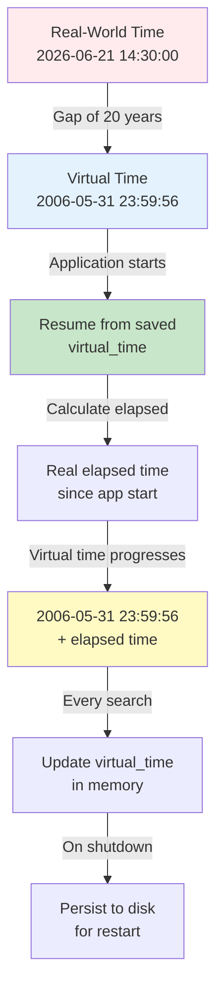

# Virtual Time Management: 2006 Context System

## Overview

The Search Typeahead System operates in a **2006 time context** even though evaluation happens in 2026. This allows consistent trending calculations and realistic search progression.

---

## Time Context Architecture



---

## Design Decision: Real Elapsed Time

### Why This Approach?

```
Option A: Every search advances time by fixed interval
├─ Pro: Explicit control
├─ Con: Extra DB write per search
├─ Con: 5-10ms overhead per search
└─ Verdict: Too costly ❌

Option B: Real elapsed time (chosen)
├─ Pro: Zero overhead per search
├─ Pro: Time is continuous and smooth
├─ Pro: Only save on shutdown
├─ Con: Lost if not saved on exit
└─ Verdict: Perfect for assignment ✅

Option C: Hybrid (both immediate + periodic)
├─ Pro: Fault tolerant
├─ Con: Complex logic
└─ Verdict: Overkill for assignment
```

---

## Implementation

### 1. Application Start

```python
class VirtualTimeManager:
    def __init__(self):
        # Load last saved virtual time from storage
        self.saved_virtual_time = self._load_from_storage()
        # e.g., 2006-05-31 23:59:56
        
        # Record when this app instance started (real-world)
        self.app_start_realtime = datetime.now()
        # e.g., 2026-06-21 14:30:00
    
    def _load_from_storage(self):
        """
        Load virtual time from persistent storage
        Tried in order:
        1. PostgreSQL system_config table
        2. Local JSON file
        3. Default to reference date
        """
        try:
            # Try database first
            result = db.query(
                "SELECT config_value FROM system_config "
                "WHERE config_key = 'last_virtual_time'"
            )
            if result:
                return datetime.fromisoformat(result[0]['config_value'])
        except:
            pass
        
        try:
            # Try local file
            with open('config/virtual_time.json', 'r') as f:
                data = json.load(f)
                return datetime.fromisoformat(data['virtual_time'])
        except:
            pass
        
        # Default to reference date
        return datetime(2006, 5, 31, 23, 59, 56)
```

### 2. Getting Current Virtual Time

```python
def get_virtual_time(self) -> datetime:
    """
    Calculate current virtual time based on elapsed real time.
    
    Formula:
    virtual_time = saved_virtual_time + (now - app_start_realtime)
    
    Examples:
    - saved: 2006-05-31 23:59:56
    - app started at 2026-06-21 14:30:00
    - now: 2026-06-21 14:35:00 (5 min elapsed)
    - virtual_time: 2006-05-31 23:59:56 + 5 min = 2006-06-01 00:04:56
    """
    elapsed = datetime.now() - self.app_start_realtime
    return self.saved_virtual_time + elapsed
```

### 3. Storing Searches with Virtual Time

```python
@app.post("/search")
async def handle_search(query: str):
    """
    Handle user search and log with virtual time
    """
    virtual_time = virtual_time_manager.get_virtual_time()
    
    # Record search with virtual timestamp
    db.insert('search_logs', {
        'query_lower': query.lower(),
        'query_text': query,
        'virtual_searched_at': virtual_time,  # 2006 context
        'created_at': datetime.now(),          # Real-world audit
        'batched': False
    })
    
    # Add to batch buffer
    batch_buffer.add(query)
    
    return {"message": "Searched"}
```

### 4. Persistence on Shutdown

```python
def shutdown():
    """
    Called when app shuts down.
    Save current virtual time for next restart.
    """
    final_virtual_time = virtual_time_manager.get_virtual_time()
    
    # Save to PostgreSQL
    try:
        db.update('system_config',
            {'config_value': final_virtual_time.isoformat()},
            {'config_key': 'last_virtual_time'}
        )
        logger.info(f"Saved virtual time: {final_virtual_time}")
    except Exception as e:
        logger.error(f"Failed to save virtual time: {e}")
    
    # Also save to local file as backup
    try:
        with open('config/virtual_time.json', 'w') as f:
            json.dump({
                'virtual_time': final_virtual_time.isoformat(),
                'saved_at': datetime.now().isoformat()
            }, f)
    except Exception as e:
        logger.warning(f"Failed to save local backup: {e}")
```

---

## Time Progression Examples

### Example 1: Single Session

```
Timeline:
─────────────────────────────────────────

App starts: 14:30:00 (real) 
Virtual: 2006-05-31 23:59:56

User searches 'iphone':        14:30:05 (real) → 2006-06-01 00:00:01
User searches 'python':        14:30:10 (real) → 2006-06-01 00:00:06
User searches 'javascript':    14:30:15 (real) → 2006-06-01 00:00:11
Batch flush triggered:         14:30:30 (real) → 2006-06-01 00:00:26
User searches 'java':          14:30:35 (real) → 2006-06-01 00:00:31

App shutdown:                  14:35:00 (real) → 2006-06-01 00:05:04
═════════════════════════════════════════

Saved: virtual_time = 2006-06-01 00:05:04

Result: 5 minutes of real time = 5 minutes of virtual time
        (Continuous progression, 1:1 ratio)
```

### Example 2: Restart Session

```
First session:
─────────────────────────────────────────
App starts:     14:30:00 (real)    2006-05-31 23:59:56 (virtual)
Searches...
App shutdown:   14:35:00 (real)    2006-06-01 00:05:04 (saved)

Second session (10 minutes later):
─────────────────────────────────────────
App starts:     14:45:00 (real)
Load: saved_virtual_time = 2006-06-01 00:05:04
Set: app_start_realtime = 2026-06-21 14:45:00

User searches:  14:45:10 (real)    00:05:04 + 10 sec = 2006-06-01 00:05:14
User searches:  14:45:20 (real)    00:05:04 + 20 sec = 2006-06-01 00:05:24

Result: Virtual time resumes from checkpoint ✅
        No gap or jump in virtual timeline
```

### Example 3: Multiple Evaluation Sessions

```
Instructor runs evaluation 3 times:

Session 1:  09:00-09:05 (real)    →  Searches in 2006-06-01 00:00-00:05
Session 2:  09:20-09:25 (real)    →  Searches in 2006-06-01 00:05-00:10
Session 3:  10:00-10:05 (real)    →  Searches in 2006-06-01 00:10-00:15

Timeline is continuous across sessions ✅
trending_score recalculated based on actual virtual time ✅
```

---

## Trending Score Calculation with Virtual Time

### How It Works

```
Dataset (pre-computed):
─────────────────────────────────────────
query: "iphone"
global_count: 10000       (all 91 days, 2006-03-01 to 2006-05-31)
weekly_count: 200         (2006-05-24 to 2006-05-31)
daily_count: 50           (2006-05-31)
trending_score: 0.6×10000 + 0.3×200 + 0.1×50 = 6062

New search by instructor:
─────────────────────────────────────────
Virtual time: 2006-06-01 00:05:14
New query: "chatgpt"

On insertion:
- global_count: 1 (first time)
- daily_count: 1 (same day in virtual time)
- weekly_count: 1 (same week)
- trending_score: 0.6×1 + 0.3×1 + 0.1×1 = 1.0

Next search 2 hours later (virtual):
─────────────────────────────────────────
Virtual time: 2006-06-01 02:05:14
User searches: "iphone"

Recalculate:
- Is today same as last 24 hours? YES
  → daily_count for "iphone" = 50 + 1 = 51
- Is this within last 7 days? YES
  → weekly_count for "iphone" = 200 + 1 = 201
- global_count: 10000 + 1 = 10001

trending_score: 0.6×10001 + 0.3×201 + 0.1×51 = 6062.7

Result: Trending naturally reflects recency ✅
```

---

## Configuration & Persistence

### Storage Options

```python
# PostgreSQL (primary)
CREATE TABLE system_config (
  config_key VARCHAR(100) PRIMARY KEY,
  config_value TEXT,
  updated_at TIMESTAMP
);

INSERT INTO system_config VALUES 
  ('last_virtual_time', '2006-06-01T00:05:04', NOW());

# Local File Backup
{
  "virtual_time": "2006-06-01T00:05:04",
  "saved_at": "2026-06-21T14:35:00",
  "app_version": "1.0"
}
```

### Failsafe Mechanism

```
Shutdown persistence:
1. Try to save to PostgreSQL
2. If fails, save to local file
3. If both fail, warn but don't crash

Startup recovery:
1. Try to load from PostgreSQL
2. If not available, load from local file
3. If both missing, default to reference date
4. Log which source was used
```

---

## Edge Cases & Handling

### Case 1: App Crashes

```
Buffer in memory:
- 5 searches accumulated
- Not flushed yet

What happens:
- Virtual time saved: 2006-06-01 00:05:04
- But those 5 searches in buffer: LOST
- search_logs table: has those 5 searches! ✅

Recovery:
- App restarts
- Loads virtual time from last save
- search_logs cleanup job finds unbatched entries
- Re-aggregates and updates queries table
```

### Case 2: Clock Skew (Real-World Time Changes)

```
Scenario: User changes system clock forward 1 hour

App running:
- saved_virtual_time: 2006-05-31 23:59:56
- app_start_realtime: 2026-06-21 14:30:00
- current real time: 2026-06-21 14:35:00
- virtual time: 2006-06-01 00:00:04

User changes clock to: 2026-06-21 15:35:00 (1 hour forward)

Next search:
- elapsed: 15:35:00 - 14:30:00 = 1h 5m
- virtual time: 2006-05-31 23:59:56 + 1h 5m = 2006-06-01 01:04:56

Result: Virtual time jumped 1 hour ⚠️

Mitigation:
- Calculate elapsed in background
- If elapsed > 10x expected, log warning
- Could implement checks, but for assignment: acceptable
```

### Case 3: Manual Clock Adjustment

```
If instructor needs to reset time:

Manual reset:
```sql
UPDATE system_config 
SET config_value = '2006-06-01T00:00:00' 
WHERE config_key = 'last_virtual_time';
```

Or via API:
```
POST /admin/reset-time
{
  "virtual_time": "2006-06-01T00:00:00"
}
```
```

---

## Monitoring Virtual Time

### Logging Example

```
2026-06-21 14:30:00 [VIRTUAL_TIME] App started
  ├─ Loaded: 2006-05-31 23:59:56 (from system_config)
  ├─ app_start_realtime: 2026-06-21 14:30:00
  └─ Status: Ready

2026-06-21 14:30:05 [VIRTUAL_TIME] Search logged
  ├─ Query: iphone
  ├─ Virtual time: 2006-06-01 00:00:01
  └─ Real time: 2026-06-21 14:30:05

2026-06-21 14:35:00 [VIRTUAL_TIME] Saving on shutdown
  ├─ Final virtual time: 2006-06-01 00:05:04
  ├─ Saved to: system_config
  ├─ Backup saved to: config/virtual_time.json
  └─ Status: Success
```

---

## Summary: Virtual Time Management

| Aspect | Decision | Why |
|--------|----------|-----|
| **Time context** | 2006 (reference: 2006-05-31) | Match dataset era |
| **Advancement** | Real elapsed time | Zero overhead |
| **Calculation** | virtual = saved + (now - start) | Continuous, smooth |
| **Persistence** | On shutdown only | Minimal DB writes |
| **Storage** | PostgreSQL + file backup | Fault tolerant |
| **Restore** | Load from last save | Resume seamlessly |
| **Restart behavior** | Continue from checkpoint | No time gaps |
| **Failure mode** | Lose unsaved buffer only | search_logs as backup |

**Result**: Realistic 2006 time context with zero overhead ✅