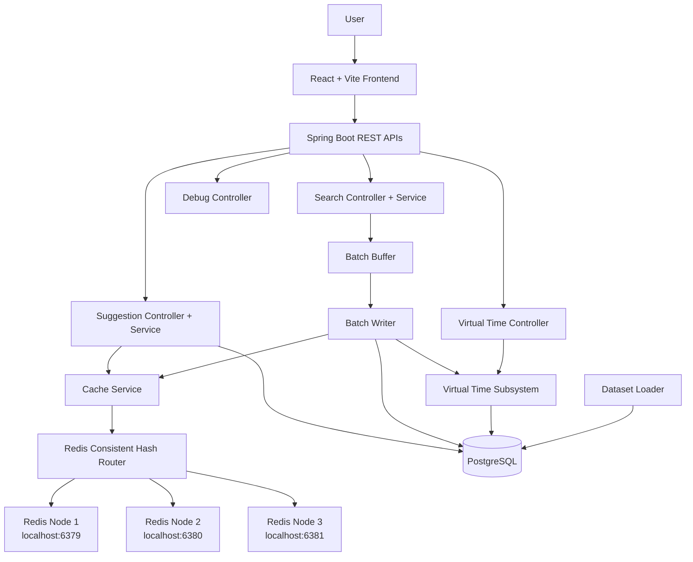

# 01 Architecture

## System Overview

The current system consists of:

- React + Vite + TypeScript frontend
- Spring Boot backend
- PostgreSQL for persistent query, search log, and config storage
- Redis Node 1 on `localhost:6379`
- Redis Node 2 on `localhost:6380`
- Redis Node 3 on `localhost:6381`

The frontend renders a single search experience with live suggestions, search submission, virtual time, and cache debugging. The backend exposes REST APIs for suggestions, search submission, trending results, cache diagnostics, and virtual time inspection.

## Architecture Diagram

## Component Responsibilities

### Controllers

- `SuggestionController` serves `/suggest` and `/trending`
- `SearchController` serves `/search`
- `DebugController` serves `/api/debug/cache`
- `VirtualTimeController` serves `/api/virtual-time`

### Services

- `SuggestionService` resolves cache hits, falls back to PostgreSQL on misses, and warms cache entries
- `SearchService` validates and logs search submissions
- `DatasetLoader` imports the dataset when enabled

### Cache Layer

- `CacheService` reads, writes, and deletes prefix cache entries
- `RedisNodeRouter` selects the Redis node for a prefix
- `ConsistentHashRing` maps prefixes to one of 16,384 slots and then to a node
- `CacheWarmupService` precomputes hot prefix entries on startup

### Batch Layer

- `BatchBuffer` aggregates search counts in memory
- `BatchWriter` flushes the buffer to PostgreSQL
- `BatchFlushScheduler` runs periodic flush checks and startup recovery

### Dataset Loader

- Runs on `ApplicationReadyEvent`
- Skips import if disabled in configuration
- Skips each table if it already contains rows
- Uses JDBC batch ingestion for CSV imports

### Virtual Time Manager

- Loads saved virtual time from PostgreSQL first
- Falls back to `config/virtual_time.json`
- Falls back to the configured reference time if needed
- Calculates current virtual time from saved time plus real elapsed time

## Request Flow

### 1. Typeahead Request

The frontend sends `GET /suggest?q=<prefix>&ranking=trending|global` only when the query has at least 3 characters.

### 2. Cache Lookup

`SuggestionService` normalizes the prefix, checks Redis through `CacheService`, and returns cached results when present.

### 3. Cache Miss Path

If Redis misses, `SuggestionService` queries PostgreSQL for the top 10 matches, builds the response DTOs, stores the cache entry, and returns the results.

### 4. Cache Hit Path

If Redis hits, `SuggestionService` returns the cached results immediately and does not query PostgreSQL.

### 5. Search Submission Path

`POST /search` validates the query, writes a `search_logs` row using virtual time, and enqueues the query in `BatchBuffer`. When `BatchWriter` flushes, it updates `queries`, marks logs as batched, advances virtual time, and invalidates affected cache prefixes.

